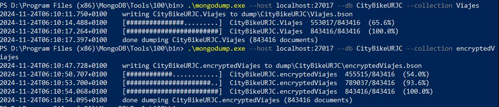
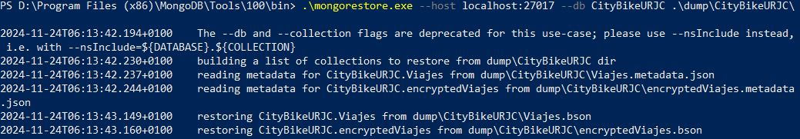
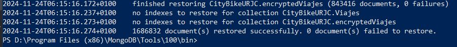

# Seguridad en Bases de Datos – Práctica 1  
## MongoDB CityBikeURJC

Práctica de la asignatura **Seguridad en Bases de Datos (URJC)** en la que se utiliza **MongoDB** y el dataset **CityBikeURJC** para comparar:

- consultas sobre una colección **sin cifrar** (`Viajes`), y  
- consultas sobre una colección con **Client-Side Field Level Encryption (CSFLE)** (`encryptedViajes`).

El objetivo principal es configurar CSFLE, poblar una colección cifrada y medir el impacto del cifrado en los tiempos de consulta, generando además salidas en CSV y un mapa de calor.

---

## Estructura del repositorio

```text
.
├─ src/
│  ├─ CityBikeURJC_main.py
│  ├─ CityBikeURJC_main_with_CSFLE2.py
│  ├─ create_master_key.py
│  ├─ create_encrypted_collection2.py
│  ├─ ejercicio7.py
│  ├─ export.py
│  └─ Mapa de calor.py
├─ data/
│  ├─ AggregateData.csv
│  ├─ resultados.csv
│  ├─ resultados2.csv
│  └─ Heatmap.html
└─ docs/
   ├─ mongodump.JPG
   ├─ restore1.JPG
   └─ restore2.JPG
```

---

## Scripts principales (`src/`)

- **`CityBikeURJC_main.py`**  
  Ejecuta consultas sobre la colección **sin cifrar** (`Viajes`), mide tiempos de respuesta y exporta resultados a CSV.

- **`CityBikeURJC_main_with_CSFLE2.py`**  
  Versión final del script principal trabajando con **CSFLE**:
  - inicializa el cliente de MongoDB con cifrado de campo,
  - consulta la colección cifrada (`encryptedViajes`),
  - mide tiempos y permite comparar cifrado vs. no cifrado.

- **`create_master_key.py`**  
  Genera el fichero `master-key.txt` con 96 bytes aleatorios que actúan como **clave maestra local** para CSFLE.  
  > Por defecto crea el fichero en el directorio de trabajo; se puede ajustar la ruta en el código.

- **`create_encrypted_collection2.py`**  
  Configura el **Key Vault**, define el esquema de cifrado y construye la colección `encryptedViajes` a partir de los datos originales:
  - inserta documentos con campos cifrados,
  - realiza comprobaciones básicas de que los datos se cifran/descifran correctamente.

- **`ejercicio7.py`**  
  Ejemplo de consulta cifrada (por ejemplo, filtrado por año de nacimiento) utilizando `ClientEncryption` y la clave maestra local.

- **`export.py`**  
  Exporta datos agregados (por ejemplo, `Viajes_por_hora`) a `data/resultados.csv` para su análisis posterior.

- **`Mapa de calor.py`**  
  Genera un **mapa de calor** en `data/Heatmap.html` a partir de `data/resultados2.csv` utilizando `folium`.

---

## Datos y resultados (`data/`)

- **`AggregateData.csv`**  
  Datos agregados obtenidos desde MongoDB (por ejemplo, estadísticas por tramo horario).

- **`resultados.csv` y `resultados2.csv`**  
  Resultados de las pruebas.

- **`Heatmap.html`**  
  Mapa de calor generado por el script `Mapa de calor.py`.  
  Se puede abrir directamente en el navegador para visualizar los resultados.

---

## Backup, borrado y restauración

El apartado 8 de la práctica recoge el proceso de **copia de seguridad** y **restauración** de las colecciones `Viajes` y `encryptedViajes` mediante `mongodump` y `mongorestore`.

- **Copia de seguridad con `mongodump`**  

  

  Se realiza un volcado de las colecciones `CityBikeURJC.Viajes` y `CityBikeURJC.encryptedViajes` a ficheros `.bson` dentro de la carpeta `dump/CityBikeURJC/`.

- **Restauración con `mongorestore` (inicio)**  

  

  Se lanza `mongorestore` indicando la carpeta `dump/CityBikeURJC/` para reconstruir las colecciones en la base de datos.

- **Restauración con `mongorestore`**  

  

  El proceso finaliza restaurando **1 688 632 documentos** (843 416 por colección) sin errores, tal y como se pedía en el enunciado.

---

## Notas personales

- Asignatura: **Seguridad en Bases de Datos (URJC)**.  
